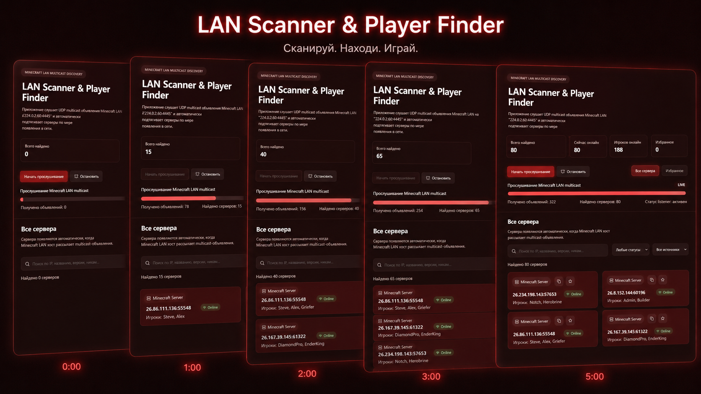

# LAN Scanner & Player Finder

# Внимание!! тут есть один баг связанный в меню майнкрафт серверов!, листайте в самый низ для большей информации. 

Desktop-приложение на Electron + React для поиска Minecraft-серверов в локальной сети.

## О программе

Это приложение сканирует локальную сеть в поисках Minecraft-серверов, которые объявляют о своем присутствии по UDP multicast. Оно показывает:

- найденные LAN-серверы Minecraft
- текущее состояние онлайн/оффлайн
- MOTD сервера
- количество игроков и список игроков
- задержку (ping) до сервера
- возможность добавлять серверы в избранное
- быстрый копирование адреса `IP:порт`
- логи отладки и прогресса сканирования



## Как это работает

В `electron/scanner.ts` реализован UDP multicast listener, который слушает сообщения от Minecraft-серверов на адресе `224.0.2.60:4445`. После получения объявления приложение проверяет сервер и получает данные о его состоянии.

Дополнительно приложение может проверять избранные серверы вручную и пинговать отдельно указанный `IP:порт`.

## Технологии

- Electron
- Vite
- React
- TypeScript
- Node.js UDP socket (dgram)
- electron-builder

## Установка

```bash
npm install
```

## Запуск в режиме разработки

```bash
npm run dev
```

Это запустит Vite для фронтенда и Electron с перезагрузкой.

## Обычный запуск

```bash
npm start
```

## Сборка

```bash
npm run build
```

## Сборка установщика / portable пакета

```bash
npm run dist
```

## Структура проекта

- `electron/` — бэкенд Electron: главный процесс, сканер LAN, Minecraft-пинг, preload
- `renderer/` — фронтенд React/Vite: приложение, компоненты, UI
- `shared/` — общие типы TypeScript между Electron и фронтендом

## Особенности

- Сканирование локальной сети Minecraft-серверов
- Поддержка LAN/Radmin-адресов
- Сохранение избранных серверов в `localStorage`
- Поиск серверов по IP, MOTD, игрокам и версии
- Отображение прогресса сканирования и статистики

## Примечания

- Скрипты запуска используют PowerShell, поэтому на Windows они работают «из коробки».
- Для корректной работы сканера необходимо, чтобы Minecraft-серверы в локальной сети отправляли объявления по UDP multicast.


## Контакты

При желании можно добавить сюда инструкцию по обратной связи и лицензию.

# Что за баг?

Баг связан с проблемой этой программы, после использования программы в майнкрафте перестает видеть LAN, после этого надо перезагружать пк.
